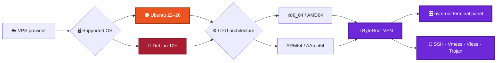

<div align="center">

# ByteRoot VPN

<a href="https://github.com/abdorabie2590/byteroot-vpn">
  
</a>

<br />

[](https://ubuntu.com/)
[](https://www.debian.org/)
[](#supported-operating-systems-and-architectures)
[](LICENSE)

**A multi-protocol VPN installation and management script with an interactive terminal control panel.**

Created by **Dev. Eng Abdelrahman Rabie**  
Telegram: [@PacketBreaker](https://t.me/PacketBreaker)

</div>

---

## At a glance



## Features

### Supported protocols and ports

| Protocol / service | Port(s) | Notes |
|---|---:|---|
| OpenSSH | 22 | Standard SSH access |
| SSH WebSocket | 80, 8080 | WebSocket transport |
| SSH Stunnel (SSL/TLS) | 442, 443 | Port 443 is shared through HAProxy |
| BadVPN UDPGW | 7100–7900 | UDP gateway range |
| Nginx | 81 | Web server / service endpoint |
| Vmess WebSocket TLS | 443 | Path: `/vmess` |
| Vless WebSocket TLS | 443 | Path: `/vless` |
| Trojan WebSocket TLS | 443 | Path: `/trojan` |
| Vmess WebSocket (No TLS) | 80 | Path: `/vmess` |
| Vless WebSocket (No TLS) | 80 | Path: `/vless` |
| Trojan WebSocket (No TLS) | 80 | Path: `/trojan` |

### How port 443 is shared

Port **443** is shared by **Stunnel (SSH-SSL)** and **Nginx (TLS WebSocket protocols)** through **HAProxy**, which routes traffic using the TLS SNI value without decrypting the connection:

- **SNI matches the configured domain** → Nginx (WebSocket protocols)
- **No SNI or a different SNI** → Stunnel (SSH-SSL)

> **SSH-SSL client note:** In clients such as HTTP Injector or KPN Tunnel, leave the SNI/SAN field blank or enter a value other than your configured domain.

### Terminal control panel: `byteroot`

- Colorful live banner showing the date, time, domain, operating system, and CPU architecture
- Live count of currently connected SSH users
- Counters for SSH, Vmess, Vless, and Trojan accounts
- Create unlimited or restricted accounts with connection, data, and expiry limits
- Track per-account traffic usage in GB
- Enable, lock, or delete accounts
- Check service status and restart services individually or all at once
- Clear caches and system logs
- Cron-based enforcement to lock or remove expired accounts and accounts that exceed their data allowance

## Supported operating systems and architectures

### Operating systems

| Distribution | Supported versions |
|---|---|
| Ubuntu | **22.04 through 26** |
| Debian | **10 and later** |

The installer is intended for the Ubuntu and Debian release ranges listed above. Compatibility on a particular VPS also depends on the provider's image, available packages, and system configuration.

### CPU architectures

- **x86_64 / AMD64**
- **ARM64 / AArch64**, including Oracle Cloud's **Ampere A1** instances

ByteRoot VPN is designed to run on these two major VPS CPU architectures; it is **not limited to one hosting company**. Other CPU architectures are not claimed as supported unless separately tested.

### VPS providers

The project identifies the following providers as tested environments:

- [DigitalOcean](https://www.digitalocean.com/)
- [Hostinger](https://www.hostinger.com/)
- [Contabo](https://contabo.com/)
- [Oracle Cloud Infrastructure](https://www.oracle.com/cloud/)

It may also be usable on compatible VPS instances from other popular providers, including [Hetzner](https://www.hetzner.com/), [Vultr](https://www.vultr.com/), [Akamai Connected Cloud (Linode)](https://www.linode.com/), [OVHcloud](https://www.ovhcloud.com/), [Amazon Web Services](https://aws.amazon.com/), [Google Cloud](https://cloud.google.com/), and [Microsoft Azure](https://azure.microsoft.com/), provided the instance uses a supported Ubuntu/Debian release and x86_64 or ARM64 architecture. These additional providers are **not listed as tested by this project**.

---

## Installation

```bash
git clone https://github.com/abdorabie2590/byteroot-vpn.git
cd byteroot-vpn
chmod +x install.sh
sudo ./install.sh
```

During installation, you will be asked to enter your domain. The installer checks that its DNS A record points to the server's IP address and automatically requests an SSL certificate through Let's Encrypt.

After installation, the control panel opens automatically. You can return to it at any time by running:

```bash
byteroot
```

## Project structure

```text
byteroot-vpn/
├── install.sh              # Main self-contained installation and setup script
├── scripts/
│   ├── byteroot-menu.sh    # Reference copy of the terminal control panel
│   ├── enforce.sh          # Reference copy of expiry/data-limit enforcement (cron: every 5 minutes)
│   └── conn_limit.sh       # Reference copy of concurrent-connection limiter (cron: every minute)
├── LICENSE
└── README.md
```

> **Note:** `install.sh` is self-contained and creates the files listed above directly on the server during installation. The files in `scripts/` are reference copies for reviewing or editing the code before upload.

## Known limitations

1. SSH data usage in GB is measured with `iptables` and counts **outbound traffic from the server only**. It is a common practical approximation, not a fully accurate measure of both upload and download traffic.
2. Connection limits for Vmess, Vless, and Trojan accounts are currently informational and are not automatically enforced. SSH connection limits are enforced through PAM and cron.
3. Expired accounts and accounts that exceed their data allowance are locked or removed by a cron job every five minutes; enforcement is not instantaneous.

## Support

For help or questions, contact us on Telegram: [@PacketBreaker](https://t.me/PacketBreaker)

## License

This project is licensed under the [MIT License](LICENSE). All rights reserved to **Dev. Eng Abdelrahman Rabie**.
